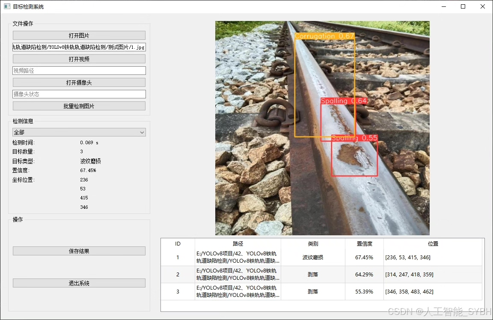
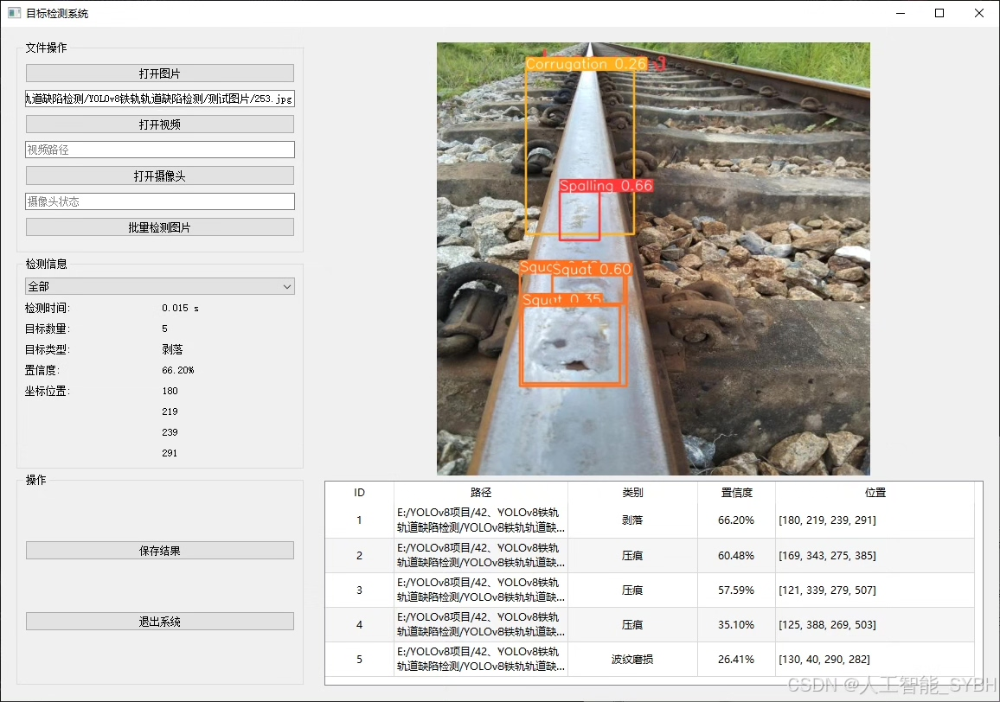
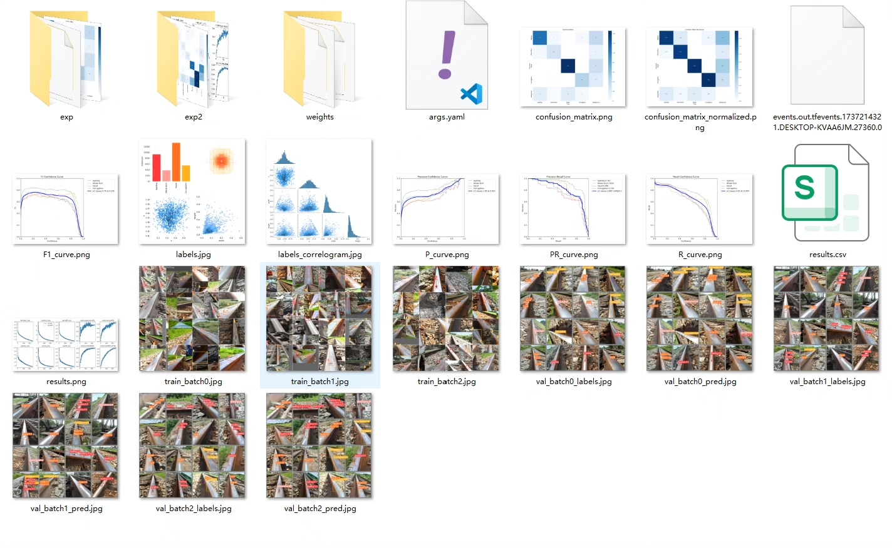
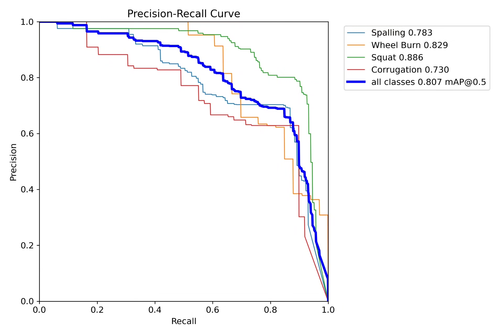
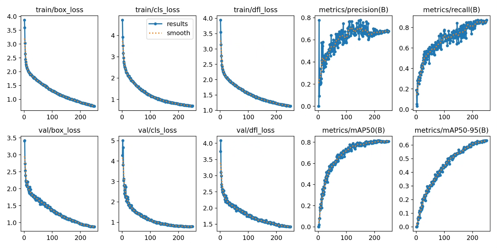
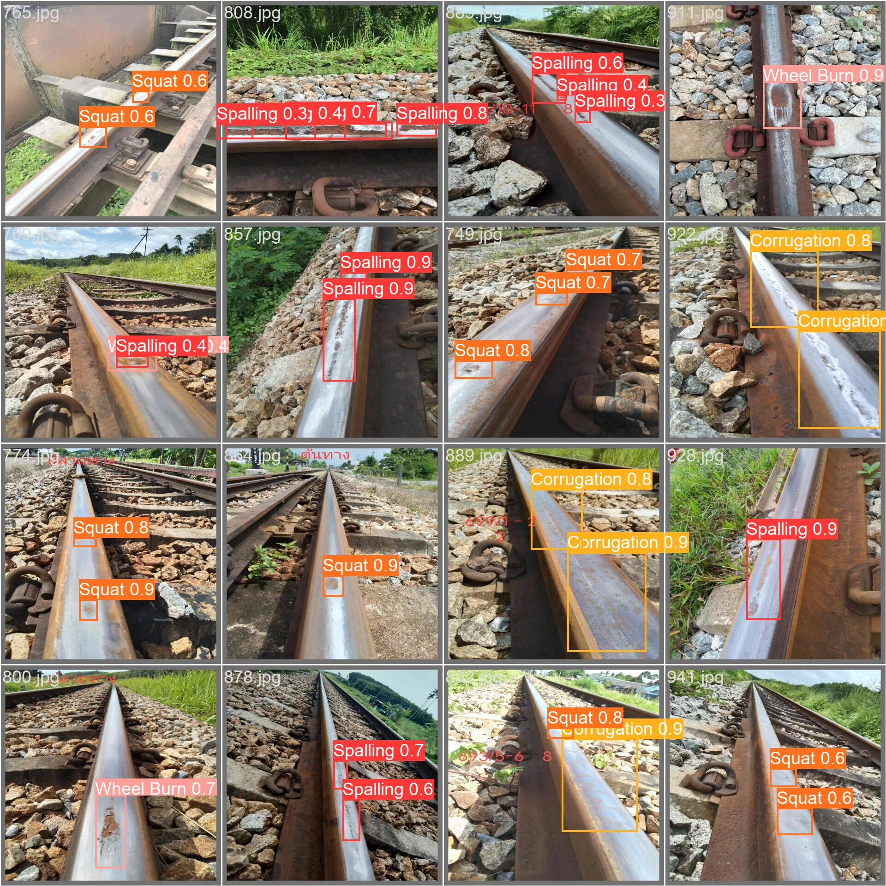
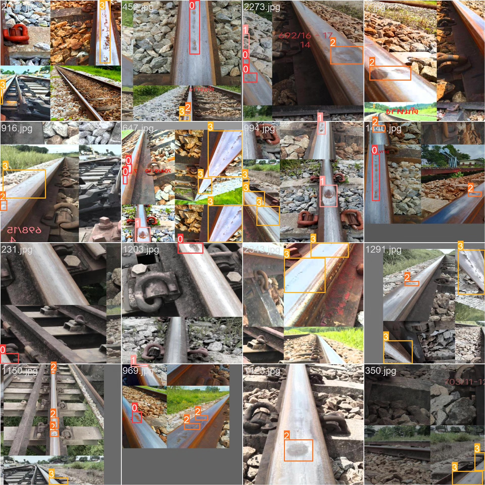

# Based on YOLOv8 deep learning for the detection of rail track defects

## Body

Based on the YOLOv8 deep learning algorithm, this project has developed a high-precision automatic detection system for rail track defects. It aims to identify and classify four common types of rail damage in real-time: spalling (Spalling), wheel burn (Wheel Burn), squat (Squat), and corrugated (Corrugation). The system is trained and optimized using high-quality rail defect datasets, including 1916 labeled images in the training set, 240 images in both the validation set and test set, ensuring robustness and generalization capabilities under complex environments.

The company's products have obtained YOLO official commercial license certification.

We offer after-sales service.

After payment, we will provide WeChat IDs for instant questions and answers.

Environment configuration: We will provide an environment configuration tutorial, with WeChat available for Q&A.

Remote installation services: If you need remote configuration, an additional fee of 69 is required, with all fees refunded if the configuration fails (only refund installation fees for older computers).

Retraining dataset: After setting up the environment, you can train on your own computer. If you need us to retrain, just pay 69 plus computing power fees (2.5 yuan/hour).

Full after-sales service

## Images

## Payment

Here is a pay link on Stripe ( https://buy.stripe.com/3cs8yP7sY87d0vu9AB ). Please contact me lonlonago@foxmail.com after funding $89, and I will send you a complete data files , thank you!

